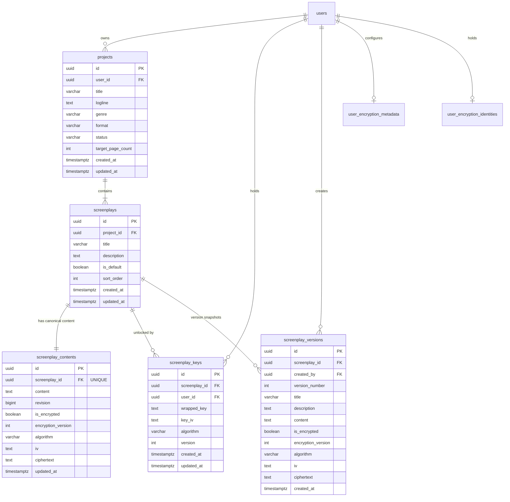

# Karu — Final Canonical Screenplay Architecture Specification

**Status:** Canonical & Fully Enacted  
**Release:** v2.0 (Post-Legacy Cleanup)  
**Security Model:** Zero-Knowledge End-to-End Encryption (E2EE)  

---

## 1. Executive Summary

Karu has completed the full migration and cleanup of its screenplay storage and cryptographic architecture. All dual-storage pathways, project-level screenplay content fields, intermediate Project Encryption Keys (PEK), and redundant plaintext database tables (`scenes`, `project_keys`) have been eliminated.

There is now exactly **one canonical screenplay architecture**:

```
projects (metadata only: title, genre, format, logline)
    │
    │ 1:N relationship (cascading delete)
    ▼
screenplays (drafts: is_default, sort_order, title)
    │
    ├── screenplay_contents (1:1 per screenplay: ciphertext, IV, revision)
    │
    ├── screenplay_keys (1:N per user: wrapped SCK with UEK)
    │
    └── screenplay_versions (1:N snapshots: encrypted checkpoints & tags)
```

---

## 2. Cryptographic Key Hierarchy

Karu employs a high-performance **2-Tier End-to-End Encryption (E2EE)** hierarchy:

```
                  ┌──────────────────────────────┐
                  │    User Secret Passphrase    │
                  └──────────────┬───────────────┘
                                 │
                                 ▼ PBKDF2-SHA256 (600,000 rounds + unique salt)
                  ┌──────────────────────────────┐
                  │ User Encryption Key (UEK)    │ (In-memory Web Crypto CryptoKey)
                  └──────────────┬───────────────┘
                                 │
                                 ▼ AES-GCM (256-bit wrap / unwrap)
                  ┌──────────────────────────────┐
                  │ Screenplay Content Key (SCK) │ (Per-screenplay random 256-bit key)
                  └──────────────┬───────────────┘
                                 │
                                 ▼ AES-GCM (256-bit, unique 12-byte IV per write)
                  ┌──────────────────────────────┐
                  │   Encrypted TipTap JSON AST  │
                  └──────────────────────────────┘
```

### Cryptographic Invariants
1. **Zero Plaintext on Server:** The server stores only ciphertext blobs, Base64-encoded IVs, and wrapped keys.
2. **Per-Screenplay Isolation:** Each screenplay draft is encrypted with a distinct, randomly generated Screenplay Content Key (`SCK`).
3. **No Intermediate PEK:** The legacy 3-tier key hierarchy (`UEK -> PEK -> SCK -> Content`) is replaced with the direct 2-tier hierarchy (`UEK -> SCK -> Content`).
4. **Asymmetric Identity:** User identity is verified via ECDH P-256 keypairs (`user_encryption_identities`) whose private keys are wrapped with the `UEK`.

---

## 3. Database Schema & Entity Relationship Diagram



---

## 4. Canonical API Endpoints

### Screenplays & Encrypted Content

| Method | Path | Description | Request Body | Response Payload |
|---|---|---|---|---|
| `GET` | `/projects/:id/screenplay` | Get or auto-provision default screenplay | None | `ScreenplayResponse` |
| `GET` | `/projects/:id/screenplays` | List all screenplay drafts for project | None | `ScreenplayResponse[]` |
| `POST` | `/projects/:id/screenplays` | Create a new screenplay draft | `CreateScreenplayRequest` | `ScreenplayResponse` |
| `GET` | `/screenplays/:id` | Get screenplay details and content | None | `ScreenplayDetailResponse` |
| `GET` | `/screenplays/:id/content` | Get active encrypted content & revision | None | `ScreenplayContentResponse` |
| `PUT` | `/screenplays/:id/content` | Autosave with optimistic concurrency | `SaveContentRequest` | `ScreenplayContentResponse` |
| `GET` | `/screenplays/:id/key` | Retrieve user's wrapped SCK | None | `ScreenplayKeyResponse` |
| `POST` | `/screenplays/:id/key` | Store wrapped SCK (UEK-wrapped) | `WrappedKeyPayload` | `ScreenplayKeyResponse` |
| `GET` | `/screenplays/:id/versions` | List version snapshots | None | `ScreenplayVersionResponse[]` |
| `POST` | `/screenplays/:id/versions` | Create milestone snapshot | `CreateVersionRequest` | `ScreenplayVersionResponse` |
| `POST` | `/screenplays/:id/versions/:vId/restore` | Atomic zero-knowledge rollback | None | `ScreenplayContentResponse` |

### User Encryption Keys & Identity

| Method | Path | Description | Request Body | Response Payload |
|---|---|---|---|---|
| `GET` | `/users/me/encryption-metadata` | Fetch salt and PBKDF2 iterations | None | `UserEncryptionMetadataResponse` |
| `POST` | `/users/me/encryption-metadata` | Store salt and PBKDF2 iterations | `UserEncryptionMetadataRequest` | `UserEncryptionMetadataResponse` |
| `GET` | `/users/me/encryption-identity` | Fetch public key & wrapped private key | None | `UserEncryptionIdentityResponse` |
| `POST` | `/users/me/encryption-identity` | Store public key & wrapped private key | `UserEncryptionIdentityRequest` | `UserEncryptionIdentityResponse` |

---

## 5. Summary of Removed Legacy Artifacts

| Component | Legacy State | Canonical Replacement |
|---|---|---|
| `projects.screenplay_content` | Dual-write plaintext/encrypted column in `projects` | Dropped in Migration 000010; stored only in `screenplay_contents` |
| `project_keys` table | 3-tier key table wrapping PEK | Dropped in Migration 000010; 2-tier SCKs stored in `screenplay_keys` |
| `scenes` table | Plaintext relational scene rows | Dropped in Migration 000010; scene list derived dynamically in TipTap |
| `projects/:id/key` API | Endpoint for project encryption keys | Completely removed (returns 404) |
| Project Screenplay Update API | Project PATCH modified screenplay text | Clean metadata-only updates |
| `loadAndUnlockProjectKey` | Frontend store method for PEK | Direct `loadAndUnlockScreenplayKey` |

---

## 6. Migration History Verification

| Migration | Status | Description |
|---|---|---|
| `000001_initial_schema` | Applied | Base tables (`users`, `projects`, `activities`) |
| `000002_auth_identities_and_screenplays` | Applied | Added `screenplays`, `screenplay_contents`, `screenplay_versions` |
| `000003_e2ee_support` | Applied | Added `user_encryption_metadata`, `screenplay_keys`, ciphertext columns |
| `000005_user_encryption_identities` | Applied | Added ECDH P-256 identity key storage |
| `000007_unified_screenplay_schema` | Applied | Added `is_default`, `sort_order`, performance indexes |
| `000008_migrate_legacy_project_screenplays` | Applied | Migrated historical drafts into canonical tables |
| `000009_cleanup_legacy_schema` | Applied | Added covering indexes for revisions and keys |
| `000010_cleanup_legacy_screenplay_schema` | Applied | Dropped `scenes`, `project_keys`, and `projects.screenplay_content` |
| `000011_enforce_screenplay_keys_fk` | Applied | Enforced strict `FOREIGN KEY (screenplay_id) REFERENCES screenplays(id)` |

---

## 7. Verification & Test Suite Status

- **Cryptographic Test Suite:** 17/17 tests passing (UTF-8/Base64, AES-GCM, PBKDF2, 2-tier UEK->SCK, ECDH P-256, TipTap AST roundtrip, 120-page benchmark).
- **Backend Test Suite:** 10/10 test suites passing (Canonical flow, concurrency revision bump, version history rollback, isolation).
- **End-to-End Flow Verification:** 100% passing against live PostgreSQL and active Go server (`scratch/test_canonical_e2e.go`).
- **Production Build:** Next.js Turbopack build passes with 0 TypeScript and 0 linting errors.
